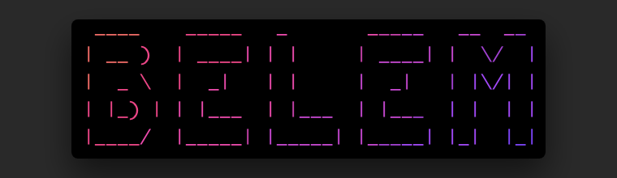

# Belém - Gateway to the Amazon River

[](https://travis-ci.com/grahamar/belem)


CLI get temporary credentials for the AWS CLI/API via the [aws-credentials-broker](https://github.com/flowcommerce/aws-credentials-broker).



## Getting AWS Temporary Credentials

```
$ go get github.com/grahamar/belem
$ cd $GOPATH/src/github.com/grahamar/belem
$ make install
$ belem login
```

## Configuration

To set your AWS credentials broker URL, you can either pass the `--broker` parameter, or create a configuration file:

Configuration File: `$HOME/.belem.yaml` (You can pass the `--config` parameter to override the default)

```yaml
broker: https://broker.example.com
```

You can also configure the `port` that the CLI listens on for the callback (default port 8765).

```yaml
port: 8765
```

The AWS CLI profile the credentials are stored for is by default `default` this can be configured via the `--profile` parameter or the `AWS_PROFILE` environment variable.
